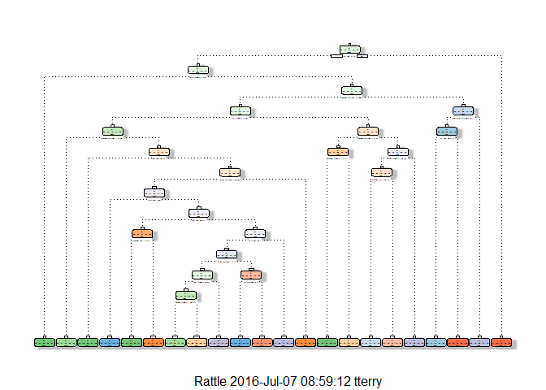
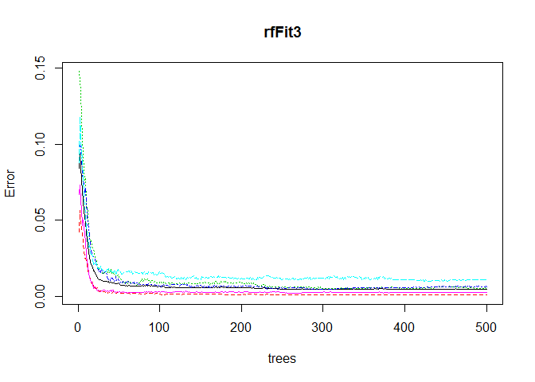

# Practical Machine Learning - Final Project
Tim Terry  
June 27, 2016  


## Synopsis

Using devices such as Jawbone Up, Nike FuelBand, and Fitbit, it is now possible to collect a large amount of data about personal activity relatively inexpensively. These type of devices are part of the quantified self-movement - a group of enthusiasts who take measurements about themselves regularly to improve their health, to find patterns in their behavior, or because they are tech geeks. 

One thing that people regularly do is quantify how much of a particular activity they do, but they rarely quantify how well they do it. In this project, the goal is to use data from accelerometers on the belt, forearm, arm, and dumbell of 6 participants. They were asked to perform barbell lifts correctly and incorrectly in 5 different ways. 

More information is available from the website here:
http://groupware.les.inf.puc-rio.br/har (see the section on the Weight Lifting Exercise Dataset).

The training data for this project are available here:
https://d396qusza40orc.cloudfront.net/predmachlearn/pml-training.csv

The test data are available here:
https://d396qusza40orc.cloudfront.net/predmachlearn/pml-testing.csv

The data for this project come from this source:
http://groupware.les.inf.puc-rio.br/har. 


```r
library(caret)
library(rattle)
library(rpart.plot)
library(randomForest)
library(rpart)
```

## Data Gathering

The files were downloaded from the above sites prior to starting the analysis and my working directory was set to their folder location.


```r
pml_train <- read.csv("pml-training.csv", sep = ",", na.strings = c("NA", "#DIV/0!", ""), header=TRUE)
pml_test  <- read.csv("pml-testing.csv", sep = ",", na.strings = c("NA", "#DIV/0!", ""), header=TRUE)

dim(pml_train); dim(pml_test);
```

```
## [1] 19622   160
```

```
## [1]  20 160
```

The "pml-testing.csv" contains the 20 samples that the final predictive model will be applied to. I want to confirm that the datasets are identical with the exception of the last column which contains our outcome.


```r
cnames_train <- colnames(pml_train)
cnames_test <- colnames(pml_test)

all.equal(cnames_train[1:159], cnames_test[1:159])
```

```
## [1] TRUE
```

## Data Processing

For Cross-Validation purposes, I'm going to split the Training dataset into two tables, one for training my model(s) and the second for testing the model(s). All data cleaning or processing that is performed on the training set (myTrain) will also be performed on the testing set (myTest).


```r
set.seed(215)

inTrain <- createDataPartition(y=pml_train$classe, p=0.7, list=FALSE)
myTrain <- pml_train[inTrain,]
myTest <- pml_train[-inTrain,]

dim(myTrain); dim(myTest);
```

```
## [1] 13737   160
```

```
## [1] 5885  160
```

During my initial data analysis it was discovered that there were a large set of variables that contained NAs. I want to remove these from my analysis. Any variable that is over 50% NA will be removed.


```r
remNA <- sapply(myTrain, function(x) mean(is.na(x))) > 0.5
table(remNA)
```

```
## remNA
## FALSE  TRUE 
##    60   100
```

100 variables will be removed. 


```r
myTrain <- myTrain[, remNA==FALSE]
myTest <- myTest[, remNA==FALSE]

dim(myTrain); dim(myTest);
```

```
## [1] 13737    60
```

```
## [1] 5885   60
```

Next, we will look for variables that have near zero variance.


```r
remNZV <- nearZeroVar(myTrain)
print(remNZV)
```

```
## [1] 6
```

This is the $new_window factor variable(yes/no)


```r
myTrain <- myTrain[,-remNZV]
myTest <- myTest[, -remNZV]
dim(myTrain); dim(myTest);
```

```
## [1] 13737    59
```

```
## [1] 5885   59
```

The first 6 variables in the dataset contain timestamps, user names, and sample identifiers. These can be removed.


```r
myTrain <- myTrain[, -(1:6)]
myTest <- myTest[, -(1:6)]

dim(myTrain); dim(myTest);
```

```
## [1] 13737    53
```

```
## [1] 5885   53
```

## Model Development

### Decision Trees

My first model attempt is a Decision Tree.


```r
dtFit1 <- rpart(classe ~., data=myTrain, method="class")
dfPredict1 <- predict(dtFit1, myTest, type="class")
confusionMatrix(dfPredict1, myTest$classe)
```

```
## Confusion Matrix and Statistics
## 
##           Reference
## Prediction    A    B    C    D    E
##          A 1490  254   30  103   43
##          B   29  585   87   37   68
##          C   48  155  818  122  143
##          D   71   85   67  638   56
##          E   36   60   24   64  772
## 
## Overall Statistics
##                                           
##                Accuracy : 0.7312          
##                  95% CI : (0.7197, 0.7425)
##     No Information Rate : 0.2845          
##     P-Value [Acc > NIR] : < 2.2e-16       
##                                           
##                   Kappa : 0.6585          
##  Mcnemar's Test P-Value : < 2.2e-16       
## 
## Statistics by Class:
## 
##                      Class: A Class: B Class: C Class: D Class: E
## Sensitivity            0.8901  0.51361   0.7973   0.6618   0.7135
## Specificity            0.8979  0.95343   0.9037   0.9433   0.9617
## Pos Pred Value         0.7760  0.72581   0.6361   0.6957   0.8075
## Neg Pred Value         0.9536  0.89092   0.9548   0.9344   0.9371
## Prevalence             0.2845  0.19354   0.1743   0.1638   0.1839
## Detection Rate         0.2532  0.09941   0.1390   0.1084   0.1312
## Detection Prevalence   0.3263  0.13696   0.2185   0.1558   0.1624
## Balanced Accuracy      0.8940  0.73352   0.8505   0.8026   0.8376
```


```r
fancyRpartPlot(dtFit1)
```



The Decision Tree resulted in an accuracy rating of 73.12% with a 95% Confidence Interval from 71.97% to 74.25%. I would like to have an Out of Sample error rate < 1%.

### Random Forest

My second model will be a Random Forest without pre-processing to see if we can get a higher accuracy result.


```r
rfFit1 <- randomForest(classe ~., data=myTrain, method="class")
rfPredict1 <- predict(rfFit1, myTest, type="class")
confusionMatrix(rfPredict1, myTest$classe)
```

```
## Confusion Matrix and Statistics
## 
##           Reference
## Prediction    A    B    C    D    E
##          A 1674    6    0    0    0
##          B    0 1131    5    0    0
##          C    0    2 1020    6    0
##          D    0    0    1  956    7
##          E    0    0    0    2 1075
## 
## Overall Statistics
##                                           
##                Accuracy : 0.9951          
##                  95% CI : (0.9929, 0.9967)
##     No Information Rate : 0.2845          
##     P-Value [Acc > NIR] : < 2.2e-16       
##                                           
##                   Kappa : 0.9938          
##  Mcnemar's Test P-Value : NA              
## 
## Statistics by Class:
## 
##                      Class: A Class: B Class: C Class: D Class: E
## Sensitivity            1.0000   0.9930   0.9942   0.9917   0.9935
## Specificity            0.9986   0.9989   0.9984   0.9984   0.9996
## Pos Pred Value         0.9964   0.9956   0.9922   0.9917   0.9981
## Neg Pred Value         1.0000   0.9983   0.9988   0.9984   0.9985
## Prevalence             0.2845   0.1935   0.1743   0.1638   0.1839
## Detection Rate         0.2845   0.1922   0.1733   0.1624   0.1827
## Detection Prevalence   0.2855   0.1930   0.1747   0.1638   0.1830
## Balanced Accuracy      0.9993   0.9960   0.9963   0.9950   0.9966
```

The Random Forest model did a significantly better job of predicting the test data with an accuracy rating of 99.51% with a 95% Confidence Interval from 99.29% to 99.67% and an Out of Sample error of 0.49%

In an attempt to see if we can improve on that rating I'm going to try pre-processing with Principle Component Analysis.


```r
rfFit2 <- randomForest(classe ~., data=myTrain, preProcess="pca", method="class")
rfPredict2 <- predict(rfFit2, myTest, type="class")
confusionMatrix(rfPredict2, myTest$classe)
```

```
## Confusion Matrix and Statistics
## 
##           Reference
## Prediction    A    B    C    D    E
##          A 1674    4    0    0    0
##          B    0 1133    6    0    0
##          C    0    2 1019    6    0
##          D    0    0    1  956    6
##          E    0    0    0    2 1076
## 
## Overall Statistics
##                                          
##                Accuracy : 0.9954         
##                  95% CI : (0.9933, 0.997)
##     No Information Rate : 0.2845         
##     P-Value [Acc > NIR] : < 2.2e-16      
##                                          
##                   Kappa : 0.9942         
##  Mcnemar's Test P-Value : NA             
## 
## Statistics by Class:
## 
##                      Class: A Class: B Class: C Class: D Class: E
## Sensitivity            1.0000   0.9947   0.9932   0.9917   0.9945
## Specificity            0.9991   0.9987   0.9984   0.9986   0.9996
## Pos Pred Value         0.9976   0.9947   0.9922   0.9927   0.9981
## Neg Pred Value         1.0000   0.9987   0.9986   0.9984   0.9988
## Prevalence             0.2845   0.1935   0.1743   0.1638   0.1839
## Detection Rate         0.2845   0.1925   0.1732   0.1624   0.1828
## Detection Prevalence   0.2851   0.1935   0.1745   0.1636   0.1832
## Balanced Accuracy      0.9995   0.9967   0.9958   0.9951   0.9970
```

Principle Component Analysis yielded a slightly higher accuracy rating, 99.54%, with a 95% Confidence Interval between 99.33% and 99.70% with an Out of Sample error of 0.46%.

Since the data in the variables we are testing with have different ranges of values I'd like to Standardize the measures to reduce any impact of highly skewed variables to see if there is an improvement in the model. 


```r
rfFit3 <- randomForest(classe ~., data=myTrain, preProcess=c("center", "scale"), method="class")
rfPredict3 <- predict(rfFit3, myTest, type="class")
confusionMatrix(rfPredict3, myTest$classe)
```

```
## Confusion Matrix and Statistics
## 
##           Reference
## Prediction    A    B    C    D    E
##          A 1674    5    0    0    0
##          B    0 1132    6    0    0
##          C    0    2 1020    5    0
##          D    0    0    0  957    7
##          E    0    0    0    2 1075
## 
## Overall Statistics
##                                          
##                Accuracy : 0.9954         
##                  95% CI : (0.9933, 0.997)
##     No Information Rate : 0.2845         
##     P-Value [Acc > NIR] : < 2.2e-16      
##                                          
##                   Kappa : 0.9942         
##  Mcnemar's Test P-Value : NA             
## 
## Statistics by Class:
## 
##                      Class: A Class: B Class: C Class: D Class: E
## Sensitivity            1.0000   0.9939   0.9942   0.9927   0.9935
## Specificity            0.9988   0.9987   0.9986   0.9986   0.9996
## Pos Pred Value         0.9970   0.9947   0.9932   0.9927   0.9981
## Neg Pred Value         1.0000   0.9985   0.9988   0.9986   0.9985
## Prevalence             0.2845   0.1935   0.1743   0.1638   0.1839
## Detection Rate         0.2845   0.1924   0.1733   0.1626   0.1827
## Detection Prevalence   0.2853   0.1934   0.1745   0.1638   0.1830
## Balanced Accuracy      0.9994   0.9963   0.9964   0.9957   0.9966
```


```r
plot(rfFit3)
```



The Standardized Random Forest resulted in the same accuracy rating, Confidence Interval, and Out of Sample error rate.

Since the results of the PCA and Standardized Random Forests are the same and each meets the goal of an Out of Sample Error Rate of < 1%, we can choose either model as our predictor for the test set. In this case I have chosen the Standardized Random Forest model.

## Results with Test Data

The first set of tasks is to apply all of the data cleaning steps from our model building to the test data in pml_test.


```r
## Remove NAs
pml_test <- pml_test[, remNA==FALSE]

## Remove Near Zero Variance
pml_test <- pml_test[,-remNZV]

## Remove first 4 variables
pml_test <- pml_test[, -(1:6)]
```

The final item is to make sure that all of the column classes for the pml_test data match those of the myTrain data.

There are three variable in pml_test that have different classes than their counterparts in myTrain. I will coerce them to match.


```r
## Coerce from int to num
pml_test$magnet_dumbbell_z <- as.numeric(pml_test$magnet_dumbbell_z)
pml_test$magnet_forearm_y <- as.numeric(pml_test$magnet_forearm_y)
pml_test$magnet_forearm_z <- as.numeric(pml_test$magnet_forearm_z)
```

Run the prediction against the pml_test data.


```r
pmlPredict <- predict(rfFit3, newdata=pml_test)

pmlPredResults <- data.frame(problem_id = pml_test$problem_id, predicted = pmlPredict)
```

### Prediction Results


```r
print(pmlPredResults)
```

```
##    problem_id predicted
## 1           1         B
## 2           2         A
## 3           3         B
## 4           4         A
## 5           5         A
## 6           6         E
## 7           7         D
## 8           8         B
## 9           9         A
## 10         10         A
## 11         11         B
## 12         12         C
## 13         13         B
## 14         14         A
## 15         15         E
## 16         16         E
## 17         17         A
## 18         18         B
## 19         19         B
## 20         20         B
```


